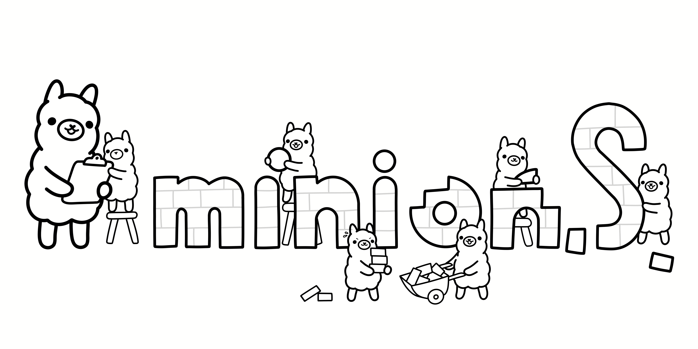

# Where On-Device and Cloud LLMs Meet
[](https://discord.gg/jfJyxXwFVa)

*What is this?* Minions is a communication protocol that enables small on-device models to collaborate with frontier models in the cloud. By only reading long contexts locally, we can reduce cloud costs with minimal or no quality degradation. This repository provides a demonstration of the protocol. Get started below or see our paper and blogpost below for more information. 

Paper: [Minions: Cost-efficient Collaboration Between On-device and Cloud
Language Models](https://arxiv.org/pdf/2502.15964)

Blogpost: https://hazyresearch.stanford.edu/blog/2025-02-24-minions 

## Setup

_We have tested the following setup on Mac and Ubuntu with Python >=3.10_

<details>
  <summary>Optional: Create a virtual environment with your favorite package manager (e.g. conda, venv, uv)</summary>
        
  ```python
  conda create -n minions python=3.13
  ```
  
</details>

**Step 1:** Clone the repository and install the Python package.

```bash
git clone https://github.com/HazyResearch/minions.git
cd minions
pip install -e .  # installs the minions package in editable mode
```

**Step 2:** Install a server for running the local model.

We support two servers for running local models: `ollama` and `tokasaurus`. You need to install at least one of these.

- You should use `ollama` if you do not have access to NVIDIA GPUs. Install `ollama` following the instructions [here](https://ollama.com/download). To enable Flash Attention, run
  `launchctl setenv OLLAMA_FLASH_ATTENTION 1` and, if on a mac, restart the ollama app.
- You should use `tokasaurus` if you have access to NVIDIA GPUs and you are running the Minions protocol, which benefits from the high-throughput of `tokasaurus`. Install `tokasaurus` with the following command:

```
uv pip install --index-url https://test.pypi.org/simple/ --extra-index-url https://pypi.org/simple/ tokasaurus==0.0.1.post1
```

**Step 3:** Set your API key for at least one of the following cloud LLM providers.

_If needed, create an [OpenAI API Key](https://platform.openai.com/docs/overview) or [TogetherAI API key](https://docs.together.ai/docs/quickstart) for the cloud model._

```bash
export OPENAI_API_KEY=<your-openai-api-key>
export TOGETHER_API_KEY=<your-together-api-key>
```

## Minions Demo Application
[](https://www.youtube.com/watch?v=70Kot0_DFNs)

To try the Minion or Minions protocol, run the following command:

```bash
streamlit run app.py
```

If you are seeing an error about the `ollama` client,

```
An error occurred: Failed to connect to Ollama. Please check that Ollama is downloaded, running and accessible. https://ollama.com/download
```

try running the following command:

```bash
OLLAMA_FLASH_ATTENTION=1 ollama serve
```

## Example code: Minion (singular)

The following example is for an `ollama` local client and an `openai` remote client.
The protocol is `minion`.

```python
from minions.clients.ollama import OllamaClient
from minions.clients.openai import OpenAIClient
from minions.minion import Minion

local_client = OllamaClient(
        model_name="llama3.2",
    )

remote_client = OpenAIClient(
        model_name="gpt-4o",
    )

# Instantiate the Minion object with both clients
minion = Minion(local_client, remote_client)


context = """
Patient John Doe is a 60-year-old male with a history of hypertension. In his latest checkup, his blood pressure was recorded at 160/100 mmHg, and he reported occasional chest discomfort during physical activity.
Recent laboratory results show that his LDL cholesterol level is elevated at 170 mg/dL, while his HDL remains within the normal range at 45 mg/dL. Other metabolic indicators, including fasting glucose and renal function, are unremarkable.
"""

task = "Based on the patient's blood pressure and LDL cholesterol readings in the context, evaluate whether these factors together suggest an increased risk for cardiovascular complications."

# Execute the minion protocol for up to two communication rounds
output = minion(
    task=task,
    context=[context],
    max_rounds=2
)
```

## Example Code: Minions (plural)

The following example is for an `ollama` local client and an `openai` remote client.
The protocol is `minions`.

```python
from minions.clients.ollama import OllamaClient
from minions.clients.openai import OpenAIClient
from minions.minions import Minions
from pydantic import BaseModel

class StructuredLocalOutput(BaseModel):
    explanation: str
    citation: str | None
    answer: str | None

local_client = OllamaClient(
        model_name="llama3.2",
        temperature=0.0,
        structured_output_schema=StructuredLocalOutput
)

remote_client = OpenAIClient(
        model_name="gpt-4o",
)


# Instantiate the Minion object with both clients
minion = Minions(local_client, remote_client)


context = """
Patient John Doe is a 60-year-old male with a history of hypertension. In his latest checkup, his blood pressure was recorded at 160/100 mmHg, and he reported occasional chest discomfort during physical activity.
Recent laboratory results show that his LDL cholesterol level is elevated at 170 mg/dL, while his HDL remains within the normal range at 45 mg/dL. Other metabolic indicators, including fasting glucose and renal function, are unremarkable.
"""

task = "Based on the patient's blood pressure and LDL cholesterol readings in the context, evaluate whether these factors together suggest an increased risk for cardiovascular complications."

# Execute the minion protocol for up to two communication rounds
output = minion(
    task=task,
    doc_metadata="Medical Report",
    context=[context],
    max_rounds=2
)
```

## Python Notebook

To run Minion/Minions in a notebook, checkout `minions.ipynb`.

## Maintainers

- Avanika Narayan (contact: avanika@cs.stanford.edu)
- Dan Biderman (contact: biderman@stanford.edu)
- Sabri Eyuboglu (contact: eyuboglu@cs.stanford.edu)
